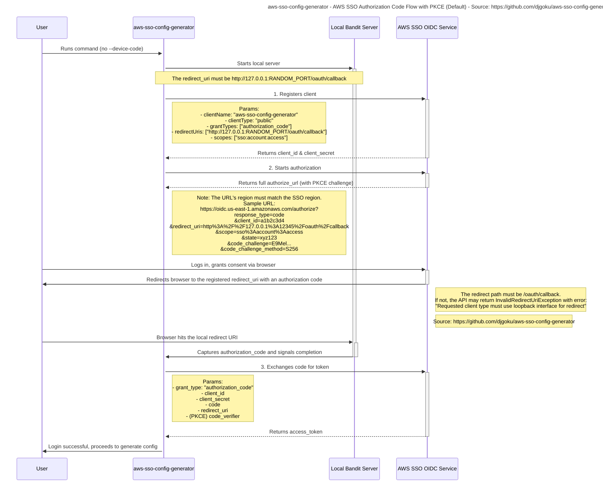

# aws-sso-config-generator - AWS SSO Authorization Code Flow with PKCE (Default)

More information on how this is implemented https://github.com/aws/aws-cli/commit/130005af5ea6a75705ed528aaf06d533f449bef9

