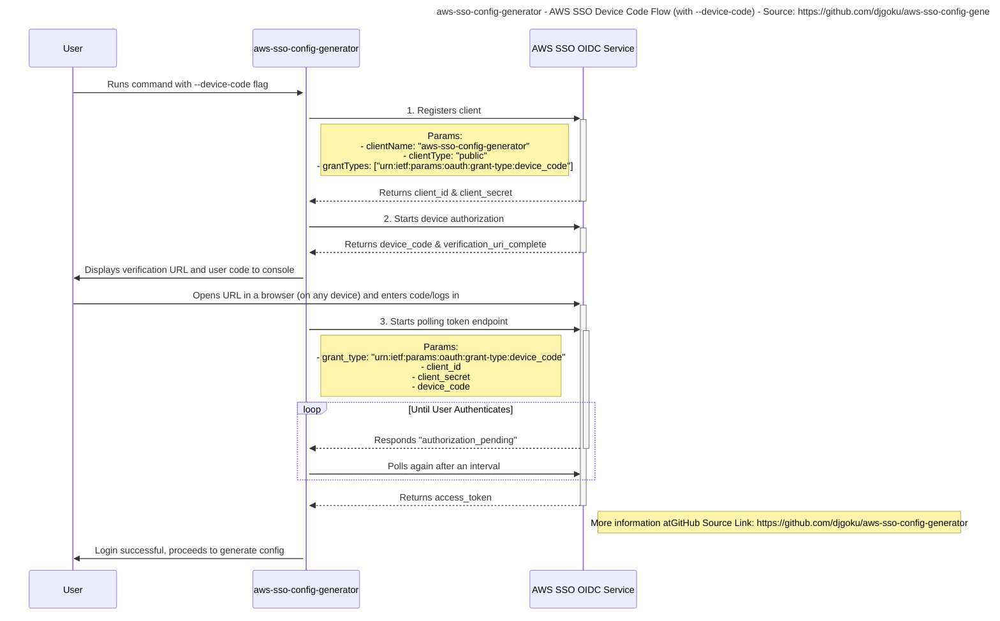

# aws-sso-config-generator - AWS SSO Device Code Flow (with --device-code)

```mermaid
sequenceDiagram
    title aws-sso-config-generator - AWS SSO Device Code Flow (with --device-code) - Source: https://github.com/djgoku/aws-sso-config-generator
    participant User
    participant CLIApp as aws-sso-config-generator
    participant AWSSSO as AWS SSO OIDC Service

    User->>+CLIApp: Runs command with --device-code flag

    CLIApp->>+AWSSSO: 1. Registers client
    Note right of CLIApp: Params:<br/>- clientName: "aws-sso-config-generator"<br/>- clientType: "public"<br/>- grantTypes: ["urn:ietf:params:oauth:grant-type:device_code"]
    AWSSSO-->>-CLIApp: Returns client_id & client_secret

    CLIApp->>+AWSSSO: 2. Starts device authorization
    AWSSSO-->>-CLIApp: Returns device_code & verification_uri_complete

    CLIApp->>User: Displays verification URL and user code to console

    User->>+AWSSSO: Opens URL in a browser (on any device) and enters code/logs in

    CLIApp->>+AWSSSO: 3. Starts polling token endpoint
    Note right of CLIApp: Params:<br/>- grant_type: "urn:ietf:params:oauth:grant-type:device_code"<br/>- client_id<br/>- client_secret<br/>- device_code
    loop Until User Authenticates
        AWSSSO-->>-CLIApp: Responds "authorization_pending"
        CLIApp->>AWSSSO: Polls again after an interval
    end
    AWSSSO-->>-CLIApp: Returns access_token
    Note right of AWSSSO: More information atGitHub Source Link: https://github.com/djgoku/aws-sso-config-generator

    CLIApp->>User: Login successful, proceeds to generate config
```
