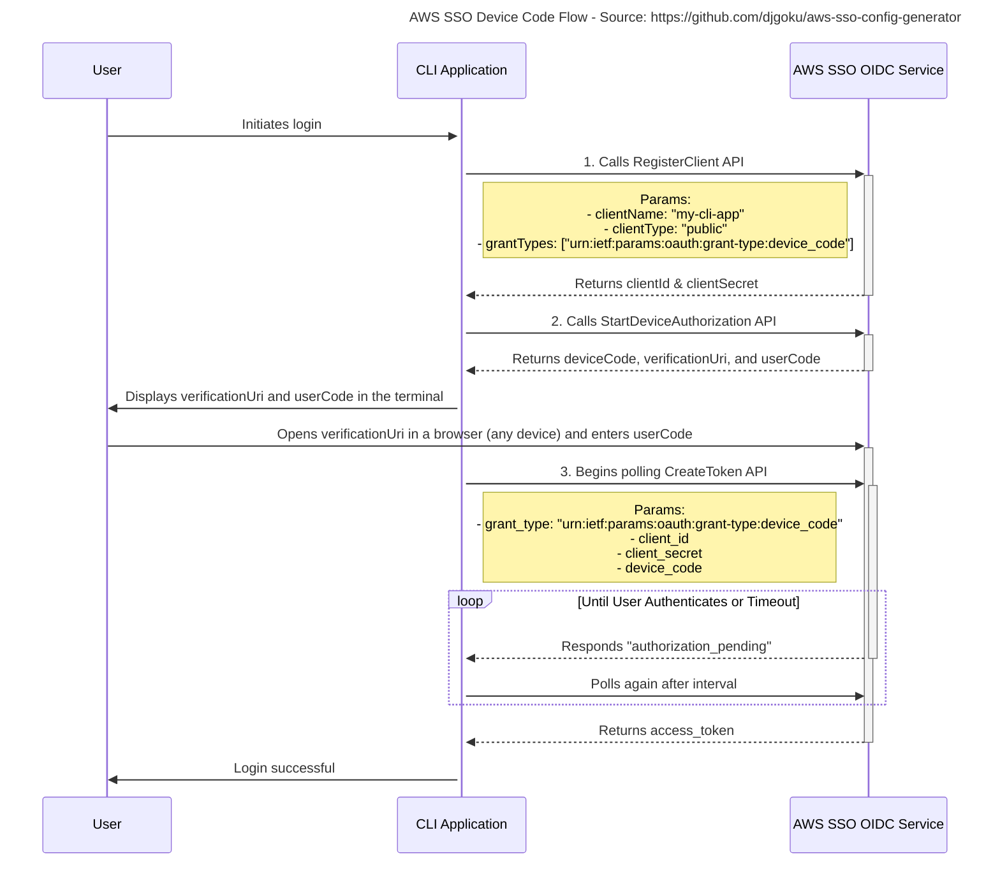

# AWS CLI - AWS SSO Device Code Flow

```mermaid
sequenceDiagram
    title AWS SSO Device Code Flow - Source: https://github.com/djgoku/aws-sso-config-generator
    participant User
    participant CLIApplication as CLI Application
    participant AWSSSO as AWS SSO OIDC Service

    User->>+CLIApplication: Initiates login

    CLIApplication->>+AWSSSO: 1. Calls RegisterClient API
    Note right of CLIApplication: Params:<br/>- clientName: "my-cli-app"<br/>- clientType: "public"<br/>- grantTypes: ["urn:ietf:params:oauth:grant-type:device_code"]
    AWSSSO-->>-CLIApplication: Returns clientId & clientSecret

    CLIApplication->>+AWSSSO: 2. Calls StartDeviceAuthorization API
    AWSSSO-->>-CLIApplication: Returns deviceCode, verificationUri, and userCode

    CLIApplication->>User: Displays verificationUri and userCode in the terminal

    User->>+AWSSSO: Opens verificationUri in a browser (any device) and enters userCode

    CLIApplication->>+AWSSSO: 3. Begins polling CreateToken API
    Note right of CLIApplication: Params:<br/>- grant_type: "urn:ietf:params:oauth:grant-type:device_code"<br/>- client_id<br/>- client_secret<br/>- device_code
    loop Until User Authenticates or Timeout
        AWSSSO-->>-CLIApplication: Responds "authorization_pending"
        CLIApplication->>AWSSSO: Polls again after interval
    end
    AWSSSO-->>-CLIApplication: Returns access_token

    CLIApplication->>User: Login successful
```
